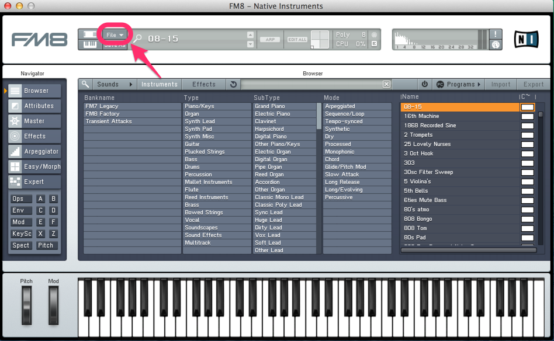
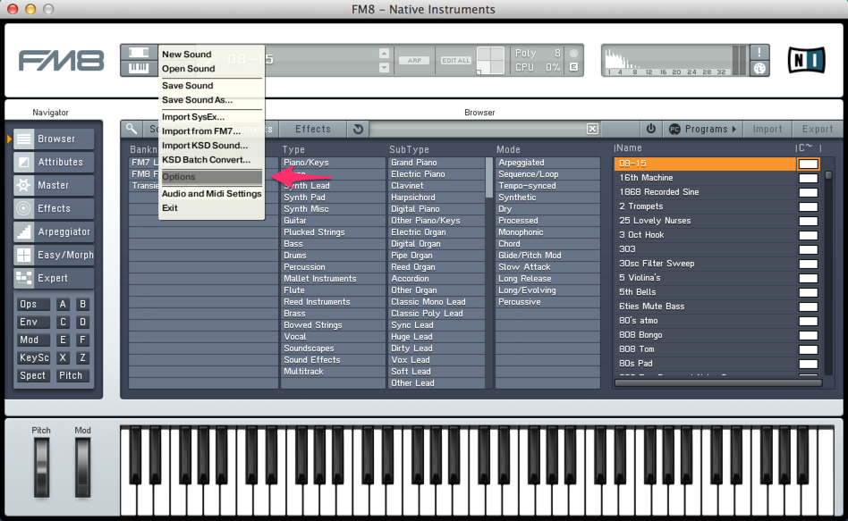
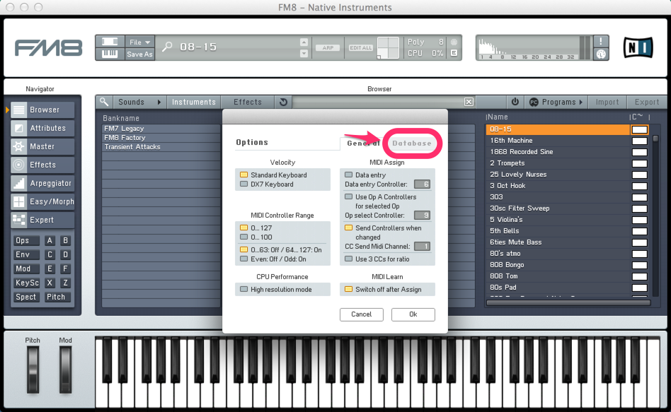
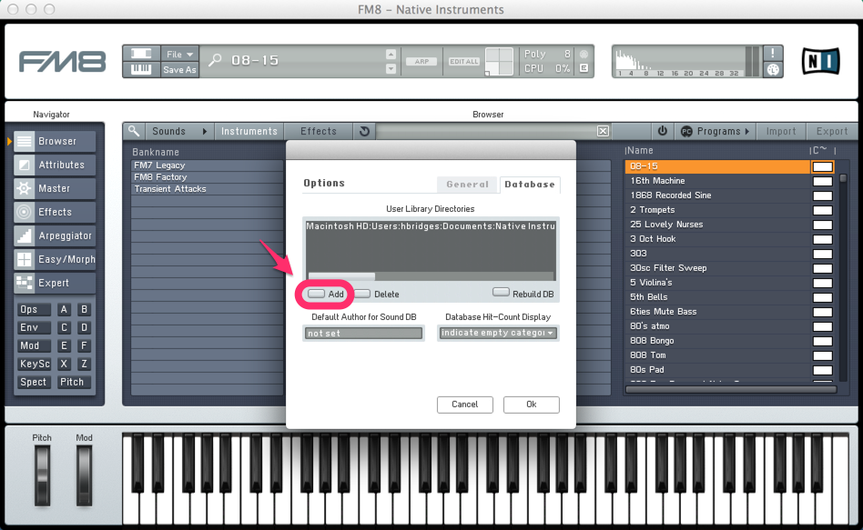
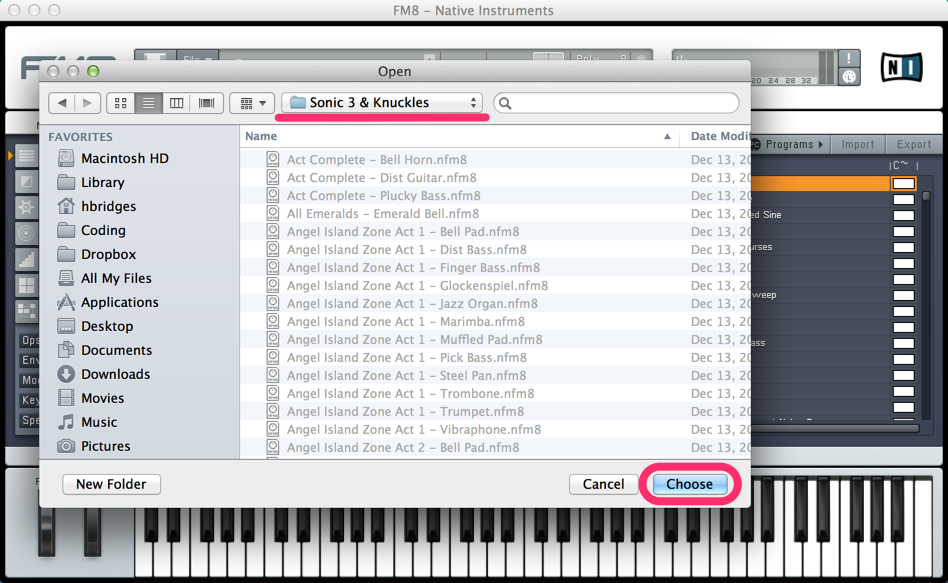
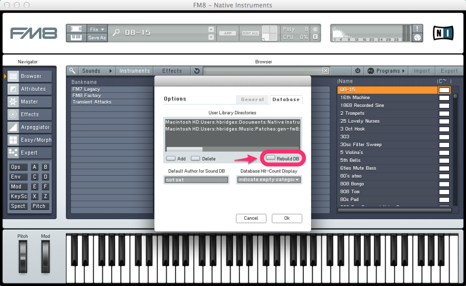
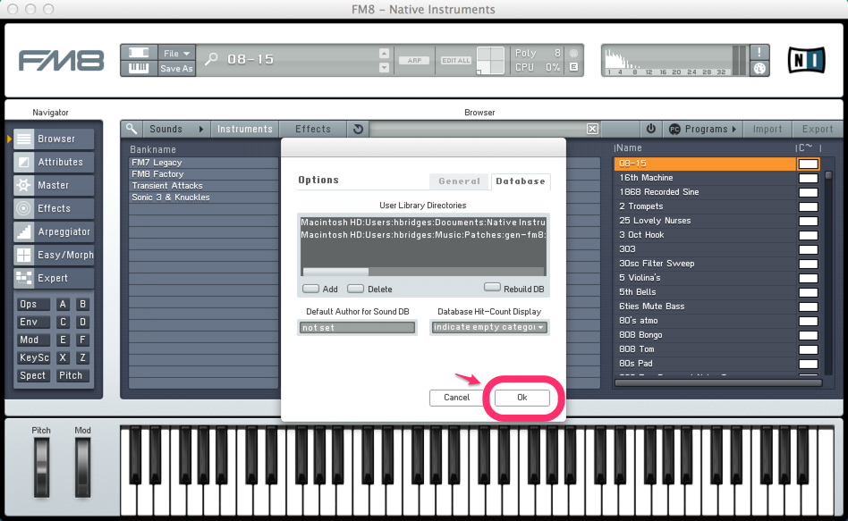
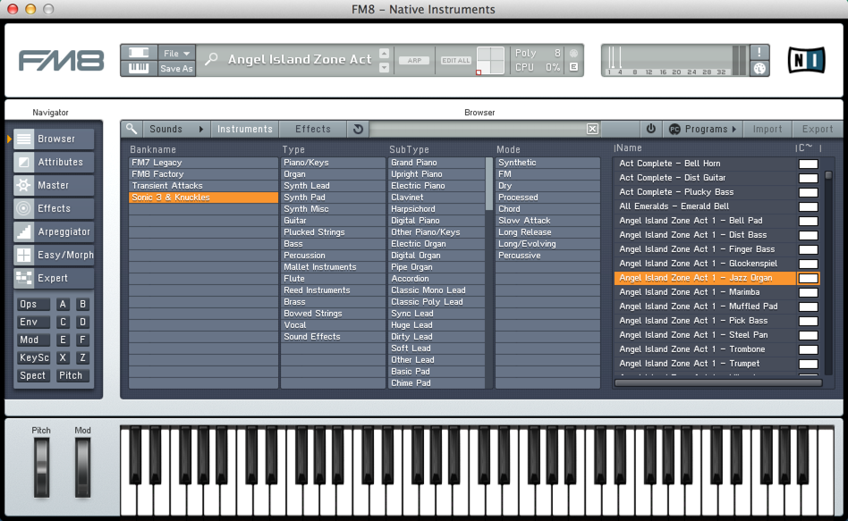

# Sonic 3 & Knuckles
## FM8 Patch Collection

### Installation Instructions

First of all, you need
[Native Instruments FM8](http://www.native-instruments.com/en/products/komplete/synths-samplers/fm8/).

Extract the ZIP contents into a directory somewhere, then follow these steps
to add the patches to FM8:

1. Click the **File** button at the top of the FM8 interface.

   

2. In the **File** menu, select **Options**.

   

3. Select the **Database** tab.

   

4. Click **Add**.

   

5. Navigate to the directory you extracted from the ZIP file, then click **Choose**.

   

6. Click **Rebuild DB**. This will add the patches into FM8’s searchable index.

   

7. Click **OK**.

   

8. Success!

   
